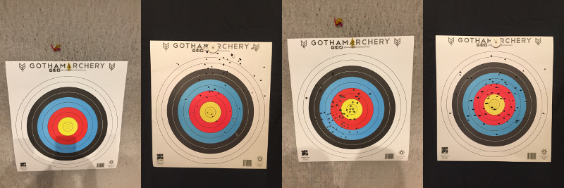
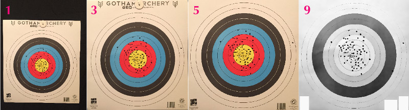
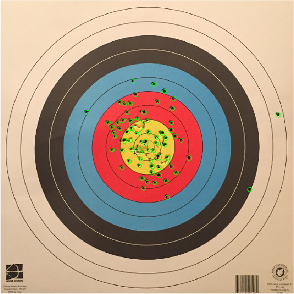

# ShotPlot Computer Vision Archery App

[**Try out ShotPlot on Heroku!**](https://lw-shotplot.herokuapp.com)

I've long been fascinated by computer vision and had been thinking about using it to develop an automatic archery scoring system for a while. A few years ago, I found out about an archery range (shout out to [**Gotham Archery**](https://www.got-archery.com/)!) that had just opened in my neighborhood and decided to check it out. I was hooked after the introductory class and have been shooting there regularly ever since. As I continued to work on improving my form, I found self-evaluation to be somewhat difficult and wanted to come up with a quick and simple way to calculate my scores and shot distributions. As I developed my skills at the Metis data science bootcamp, I started to get a clearer vision of how exactly I could build such a tool. My initial app idea involved live object tracking running on a mobile device, which I quickly realized might be too ambitious for a computer vision neophyte. I eventually settled on a plan to analyze a single target photo to derive shot positions and an average shot score for the session.

### Data Collection

Before gathering my initial data, I set some restrictions on what each of those images would require. I wanted images to have all four corners of the target sheet visible so I could unskew and uniformly frame each one. Photos also needed to have enough contrast to pick out the target sheet and shot holes from the background. In order to keep the scope of the project manageable, I only used a single type of target: the traditional single-spot, ten ring variety. With those parameters in mind, I collected target data in two ways over several trips to the aforementioned [**Gotham Archery**](https://www.got-archery.com/); I used my iPhone to photograph my target after each round of shooting at the range and also collected several used targets others had shot from the range's discard bin. I set up a small home studio to quickly shoot the gathered targets but did not use any special lighting, camera equipment, or a tripod because I wanted the images to represent what an app user could easily produce themselves. I ended up collecting around 40 usable targets (some were too creased or torn) and set aside eleven of those to use as a test set to evaluate the app's performance.

### Choosing an Algorithm

With my data in hand I was ready to start writing some code to process my image data into qualitative values, which meant choosing between one of a couple diverging approaches. Either training a Convolutional Neural Network or a more manual image processing approach would work to calculate scores, but both options come with benefits and important limitations:

| Algorithm         | Pros                                    | Cons                         |
| ----------------- | --------------------------------------- | ---------------------------- |
| CNN               | Probably less coding                    | Might need more data         |
|                   | High personal interest                  | **Only good for score data** |
| Manual Processing | Needs less data                         | Probably more coding         |
|                   | **Good for scores and positional data** | Less sexy                    |

Going with a neural network may have been difficult due to the small number of targets I had collected. Even though I could have boosted the dataset by taking multiple photographs of each target from different angles and orientations I'm still not sure I would have had enough to train a quality model. However the real dealbreaker for me was that a CNN would not be able to provide me with shot coordinates, which I really wanted to help break down an archer's inconsistencies. Heavily processing images with OpenCV was simply the better solution for my problem, no matter how much I would have liked to work with neural networks on this project.

### Image Processing with OpenCV

OpenCV has a vast selection of image processing tools that can be intimidating at first glance and I spent the first few days working with the library just learning what commands might prove useful. Between my own exploration and reading a few blogs, like the incredibly helpful [**pyimagesearch**](https://www.pyimagesearch.com/), I was able to work out the common strategy of **filter-gather-transform**. I applied **filters** to an image in order to **gather** specific data that I would then use to **transform** the image somehow. For example, in order to remove perspective skew, I found the corners of the target sheet and then used their coordinates to pull those edges to the corners of the image. I repeated the **filter-gather-transform** process several times in order to consistently frame targets and then acquire shot positions. I broke down the work into roughly 12 steps:
1. Import image and set colorspace
2. Find target sheet corners
3. Remove perspective skew
4. Find scoring region circles
5. Resize image into a square with circles centered
6. Separate image by background color
7. Balance values of each part to make holes stand out
8. Recombine image
9. Obscure logos at bottom of target sheet
10. Use blob detection to find holes
11. Split up large blobs that are clusters of shots
12. Calculate shot scores based on distance from center

Here are some sample images showing what a target looks like at various steps:

You can check out larger versions of the images in [**the 'shotplot.ipynb' notebook**](shotplot.ipynb), which runs through the entire shot identification process. The actual code for the OpenCV processing lives in [**target_reader.py**](code/target_reader.py). Here is a sample image of a target with identified shots circled:

### Algorithm Performance

